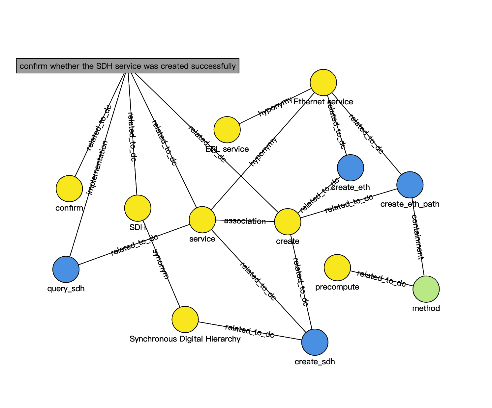

# TOKTER
Code for the paper "Harnessing Test-Oriented Knowledge Graphs for Enhanced Test Function Recommendation". 

## Dataset
Due to our agreement with our industrial partner, industrial data cannot be publicly disclosed. Therefore, we will use a sample dataset to demonstrate how TOKTER recommends test functions based on the test-oriented knowledge graph.

The sample dataset contains all types of entities and relations, as shown in the following table and figure. 

Entities and Relations| Count
-|-
domain concept entity|8
test function entity|4
test step entity|1
function parameter entity|1
synonymy relation|1
hyponymy relation|2
association relation|1
related_to_dc relation|13
implementation relation|1
containment relation|1

Yellow circles represent domain concept entities, blue circles represent test function entities, green circles represent function parameter entities, and gray squares represent test step entities.




The functionality descriptions and parameters of the four test functions are as follows.
```
function_list = [
    {
        'name': 'create_sdh',
        'desc': 'create an Synchronous Digital Hierarchy service'
    },
    {
        'name': 'create_eth',
        'desc': 'create an Ethernet service'
    },
    {
        'name': 'create_eth_path',
        'desc': 'create an Ethernet service',
        'param': {
            'method': {
                'desc': 'create method',
                'values': ['precompute']
            }
        }
    },
    {
        'name': 'query_sdh',
        'desc': 'get the current status of the service'
    }
]
```

Historical test steps and their implementation test functions are as follows.
```
historical_test_case = [
    {
        'test step': 'confirm whether the SDH service was created successfully',
        'test function': ['query_sdh']
    }
]
```

## Usage

* run `rec_test_functions` method in `recommendation.py` to recommend test functions for the 4 queries.
```
'create an EPL service' (ground truth test function: create_eth)
'create an SDH service' (ground truth test function: create_sdh)
'confirm whether the service was created successfully' (ground truth test function: query_sdh)
'precompute an Ethernet service' (ground truth test function: create_eth_path)
```


## Notes
* The `build_kg` method in `build_knowledge_graph.py` is to build the test-oriented knowledge graph using NetworkX tool.
* The `build_cache` method in `recommendation.py` is the method to create a path cache file before recommending test functions, which can increase the speed of recommendation.
* The `DomainConcept.txt` file is the list of domain concepts reviewed by domain experts.

## Citation